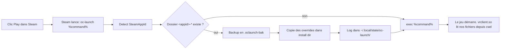

# OpenComposite per-game config (NixOS + nix-maid)

Système déclaratif, fine-grained et opt-in pour surcharger les bindings et
les tunables OpenComposite **par jeu**, sans casser les jeux qui fonctionnent
déjà.

## Pourquoi ce module existe

Cette machine utilise WiVRn comme runtime OpenXR sans-fil pour un Meta Quest,
et OpenComposite comme shim OpenVR → OpenXR (cf. `gaming/steam.nix`). Dans
cette configuration, SteamVR est court-circuité (`use-steamvr-lh = false`),
donc l'interface "Steam Input Bindings" de SteamVR n'est jamais consultée
pour les jeux OpenVR. Les bindings de chaque jeu sortent uniquement de :

1. Les options globales de `opencomposite.ini`.
2. Les fichiers `actions.json` / `bindings_<profil>.json` que **le jeu**
   embarque dans son dossier d'install.

Pour les corriger sans toucher au dossier du jeu à la main et sans tout casser
pour les autres titres, on a besoin d'un mécanisme déclaratif et per-game.

## Comment OpenComposite trouve sa config (vérité du code source)

Source: [`OpenOVR/Misc/Config.cpp`](https://raw.githubusercontent.com/aashishvasu/OpenComposite/main/OpenOVR/Misc/Config.cpp).

- **Linux** : `opencomposite.ini` est lu **uniquement** depuis le `cwd` du
  processus, via `getcwd() + "/opencomposite.ini"`. Aucun XDG, aucune variable
  d'environnement, aucun chemin de DLL. Steam lance les jeux Proton avec
  `cwd = <dossier d'install>`, donc c'est là qu'OpenComposite cherchera.
- Les **bindings de contrôleurs** (`bindings_oculus_touch.json` etc.) sont
  référencés depuis `actions.json`, lequel est lu via l'API
  `IVRInput::SetActionManifestPath` quand le jeu appelle OpenComposite.
  Ils sont donc lus depuis le dossier d'install du jeu.

## Options réellement supportées par `opencomposite.ini`

Vérifiées dans les strings du binaire installé (`vrclient.so`, révision
`cff07db7`) :

`admitUnknownProps`, `enableHiddenMeshFix`, `handColour`, `haptics`,
`hiddenMeshVerticalScale`, `initUsingVulkan`, `invertUsingShaders`,
`logAllOpenVRCalls`, `logGetTrackedProperty`, `renderCustomHands`,
`stopOnSoftAbort`, `supersampleRatio`.

**Toute autre clé** (par exemple `forceProfile`, `enableAppRequestedBindings`)
**n'existe pas** dans ce build et fait crasher OpenComposite au lancement avec
une popup `Unknown config option`.

Conclusion: `opencomposite.ini` ne permet **pas** de remapper des contrôleurs.
Le seul levier disponible côté OpenComposite, c'est de surcharger les fichiers
JSON SteamVR-Input du jeu.

## Architecture

```
gaming/vr/opencomposite/
├── default.nix              Module Nix (writeShellApplication + nix-maid)
├── oc-launch.sh             Source du wrapper
├── README.md                Ce fichier
├── global/
│   └── opencomposite.ini    Tunables globaux (immuable, via ${self})
└── games/                   Mutable, via {{home}}/etc/nixos/...
    ├── _template/           Modèle pour ajouter un nouveau jeu
    └── 617830-superhot-vr/  Overrides Superhot VR (appid 617830)
```

Le module déploie via nix-maid :

| Cible runtime | Source repo | Mode |
|---|---|---|
| `~/.config/opencomposite/global/opencomposite.ini` | `gaming/vr/opencomposite/global/opencomposite.ini` | Immuable (rebuild requis) |
| `~/.config/opencomposite-games/` | `gaming/vr/opencomposite/games/` | Mutable (édition à chaud) |

Le binaire `oc-launch` est ajouté à `environment.systemPackages`.

## Le wrapper `oc-launch`

Au lancement d'un jeu, Steam appelle `oc-launch %command%`. Le wrapper :

1. Lit `SteamAppId` (variable d'environnement injectée par Steam).
2. Cherche un dossier `~/.config/opencomposite-games/<appid>[-<slug>]/`.
3. Si trouvé, pour chaque fichier de ce dossier (hors `NOTES.md`, `README*`,
   `.bak`, dotfiles) :
   - Sauvegarde l'original existant en `.oclaunch-bak` (une fois seulement).
   - Copie le fichier dans le dossier d'install du jeu (cwd de Steam).
4. Si aucun `opencomposite.ini` per-game n'est défini mais que le global
   existe, copie le global comme fallback.
5. Logge l'opération dans `~/.local/state/oc-launch/<appid>-<ts>.log`.
6. `exec "$@"` (le jeu démarre avec cwd inchangé, donc OpenComposite trouvera
   notre `opencomposite.ini` et lira nos JSON).

Si aucun dossier per-game n'existe pour l'appid courant, le wrapper se met en
mode passthrough et `exec`'e directement la commande Steam : **les autres
jeux ne sont jamais touchés**.



## Activer le wrapper pour un jeu

Dans Steam : clic droit sur le jeu → Properties → Launch Options :

```
oc-launch %command%
```

Lance ensuite le jeu. Vérifie le log :

```sh
ls -t ~/.local/state/oc-launch/*.log | head -1 | xargs tail
```

Tu dois voir des lignes `deployed <fichier> -> /games/.../...`.

## Ajouter un nouveau jeu

1. Identifier l'appid. Soit dans l'URL Steam Store, soit via la commande :

   ```sh
   grep -lE '"appid"\s+"[0-9]+"' \
     /games/SteamLibrary/steamapps/appmanifest_*.acf
   ```

2. Copier le template :

   ```sh
   cp -r gaming/vr/opencomposite/games/_template \
         gaming/vr/opencomposite/games/<appid>-<slug>
   ```

3. Auditer le jeu : aller dans son dossier d'install et lister les fichiers
   SteamVR-Input :

   ```sh
   ls "/games/SteamLibrary/steamapps/common/<game>/" \
     | grep -E "action|binding"
   ```

   Ouvrir `actions.json` pour comprendre les actions internes du jeu, puis
   `bindings_oculus_touch.json` (le profil pertinent pour Quest Touch) pour
   voir le mapping stock.

4. Copier le ou les `bindings_<profil>.json` qu'il faut surcharger dans
   `gaming/vr/opencomposite/games/<appid>-<slug>/` et éditer **uniquement**
   les entrées problématiques.

5. Documenter le diff dans `NOTES.md`.

6. Dans Steam, ajouter `oc-launch %command%` aux Launch Options du jeu.

7. Lancer le jeu une première fois, vérifier les logs, valider en jeu.

## Auditer / déboguer ce qu'OpenComposite a effectivement lu

Si `PROTON_LOG=1` est actif (c'est le cas globalement dans `gaming/steam.nix`),
chaque lancement génère `~/steam-<appid>.log` ou `~/steam-*.log` qui contient
les messages `OpenComposite` en clair :

```sh
ls -t ~/steam-*.log | head -1 \
  | xargs grep -E "Reading config file|Setting config param|No config file"
```

Tu dois voir :

- `Reading config file at /games/.../opencomposite.ini` si le ini est trouvé.
- `Setting config param supersampleRatio to 1.0` etc. pour chaque clé lue.
- `No config file found at ...` si OpenComposite n'a rien trouvé.

## Sous-commandes utilitaires

```sh
oc-launch list                  # Liste les jeux avec une config
oc-launch status 617830         # Détail des fichiers et logs pour Superhot
oc-launch restore 617830        # Restaure les originaux depuis les .oclaunch-bak
oc-launch --dry-run %command%   # Affiche ce qui serait fait, n'écrit rien
```

`restore` retrouve le dossier d'install via le dernier log du jeu. Si aucun
log n'existe encore, passe `OC_LAUNCH_INSTALL_DIR=<path>` :

```sh
OC_LAUNCH_INSTALL_DIR="/games/SteamLibrary/steamapps/common/SUPERHOT VR" \
  oc-launch restore 617830
```

## Limites et risques connus

- **NTFS3 sur `/games`** : les copies fonctionnent en POSIX-ish, on évite les
  symlinks. Le wrapper utilise `cp -f` (pas `cp -a`) pour rester compatible.
- **Steam update** : un update du jeu peut écraser nos fichiers. Le wrapper
  redéploie à chaque lancement, donc la régression est auto-corrigée au
  prochain lancement avec `oc-launch %command%`.
- **Crash entre backup et copy** : `oc-launch restore` détecte les
  `.oclaunch-bak` orphelins et les remet en place.
- **Pas d'option `forceProfile` ou `enableAppRequestedBindings`** dans ce build
  d'OpenComposite. Si une révision future les expose, simplifier l'approche
  est possible.

## Références

- Code source `Config.cpp` :
  <https://raw.githubusercontent.com/aashishvasu/OpenComposite/main/OpenOVR/Misc/Config.cpp>
- Wiki OpenComposite : <https://gitlab.com/znixian/OpenOVR/-/wikis/>
- Format SteamVR Input :
  <https://github.com/ValveSoftware/openvr/wiki/SteamVR-Input>
- Audit Steam + VR du repo : [../steam-vr-config-audit.md](../steam-vr-config-audit.md)
- Configuration Steam : [../../steam.nix](../../steam.nix)
- Configuration WiVRn : [../vr.nix](../vr.nix)
